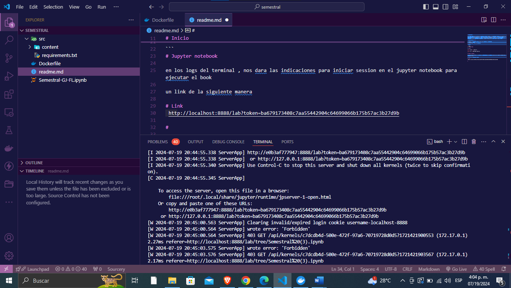

# Descripción 

Para poder correr este notebook es necesario instalar magenta , la dificultad radica en que magenta no esta disponible para windows por lo cual hay dos vias de corre este notebook , la primera seria ejecutarlo en linux siguiendos las guias de instalación de magenta o esta forma que es desplegar un contenedor con las dependecias necesarias y jupyter notebook para poder verlo de mejor manera.

# Requerimientos de PC

1. Docker : es necesario tener docker para ejecutar el contenedor
2. Internet : obvio 
3. visual code : solo por facilidad 

# Inicio 

```bash
git clone [$repo](https://github.com/LeonardoFranco28/semestral.git)

cd semestral

docker build -t semestral . 

docker run -p 8888:8888 semestral 

```
# Jupyter notebook 

en los logs del terminal , nos dara las indicaciones para iniciar session en el jupyter notebook para ejecutar el book 

un link de la siguiente manera 

# Link
 http://localhost:8888/lab?token=ba679173408c7aa55442904c64699066b175b57ac3b27d9b

 

# Proyecto 

Paso 1 : en este punto debemos , descargar desde el repositorio oficial de magenta uno de sus modelos 
music_vae , usaremos su modelo pre-entredano llamado  
-- cat-mel_2bar_big
https://github.com/magenta/magenta/tree/main/magenta/models/music_vae

lo descargamos y descomprimimos 

Paso 2 : posterior a esto tendremos que crear una carpeta llamada content para subir los 2 archivos descomprimidos mencionados en el paso 1  


Paso 3 :  
Subimos el archivo .ipynb  y lo abrimos como notebook que hace referencia al proyecto semestral 


#LINK Notebook

https://utpac-my.sharepoint.com/:u:/g/personal/leonardo_franco_utp_ac_pa/EUw4lepDMsdMqK33kCLzRMIBvpIRI4JlBHpp_oXTDbjiaw?e=YZrBo8


# Conclusión 

siguiendo estos paso ya es posible ejecutar codigo con el framework de magenta , asi como ser portatil para cualquier sistema operativo

